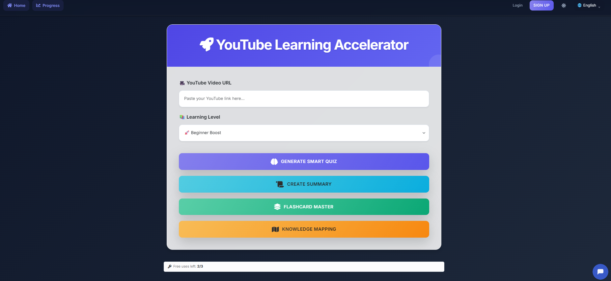
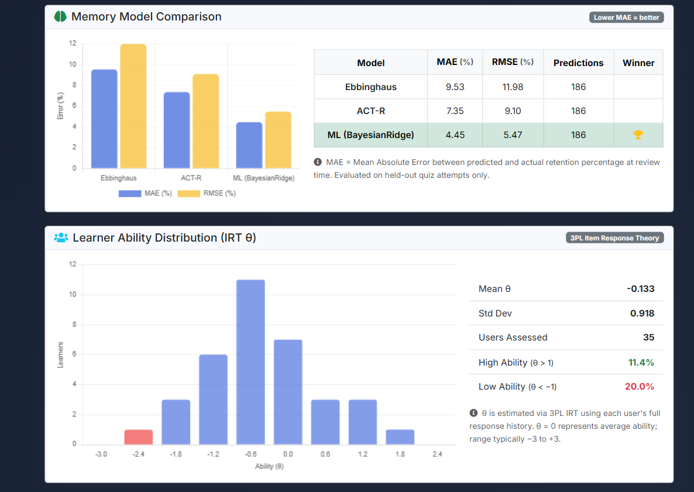
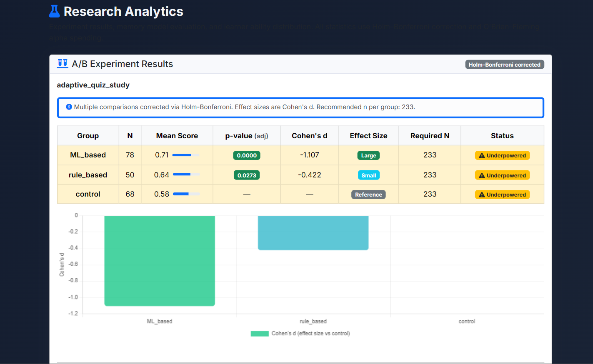
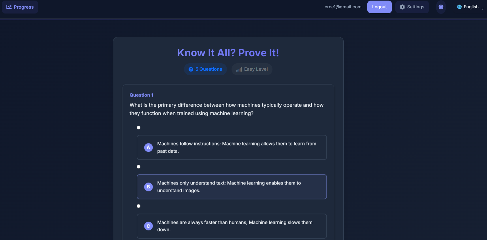
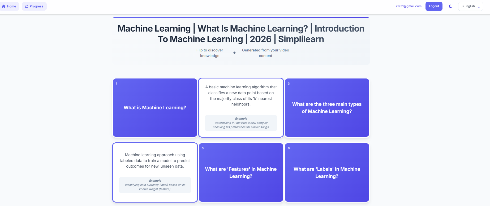
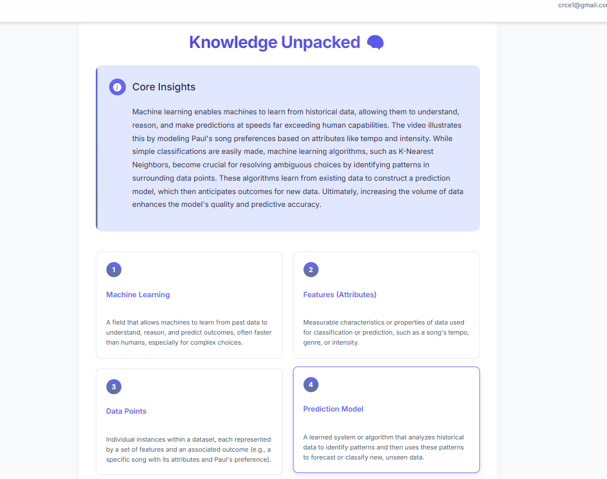
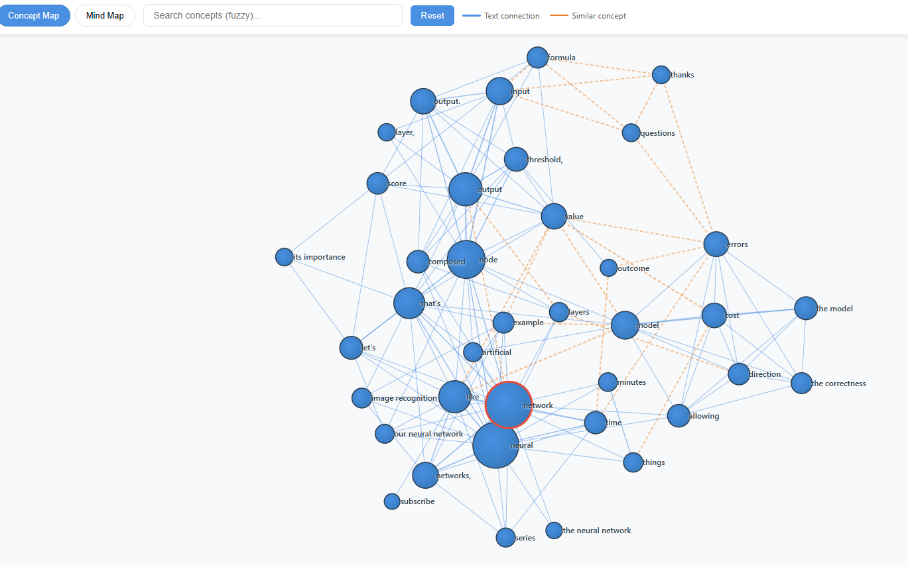
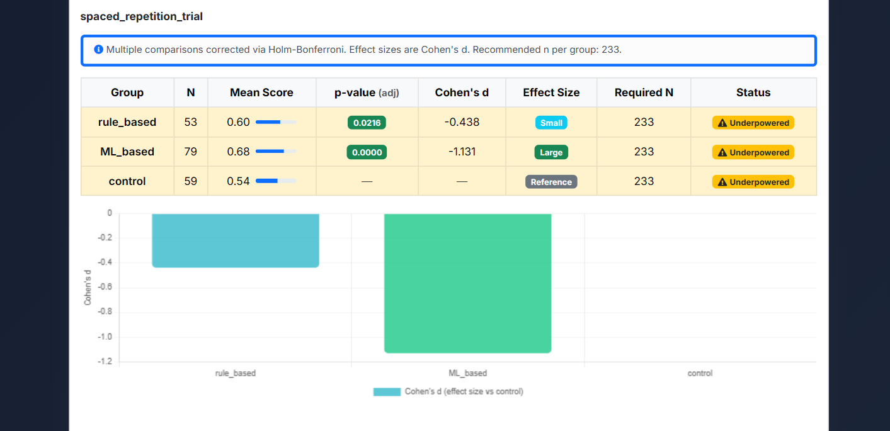
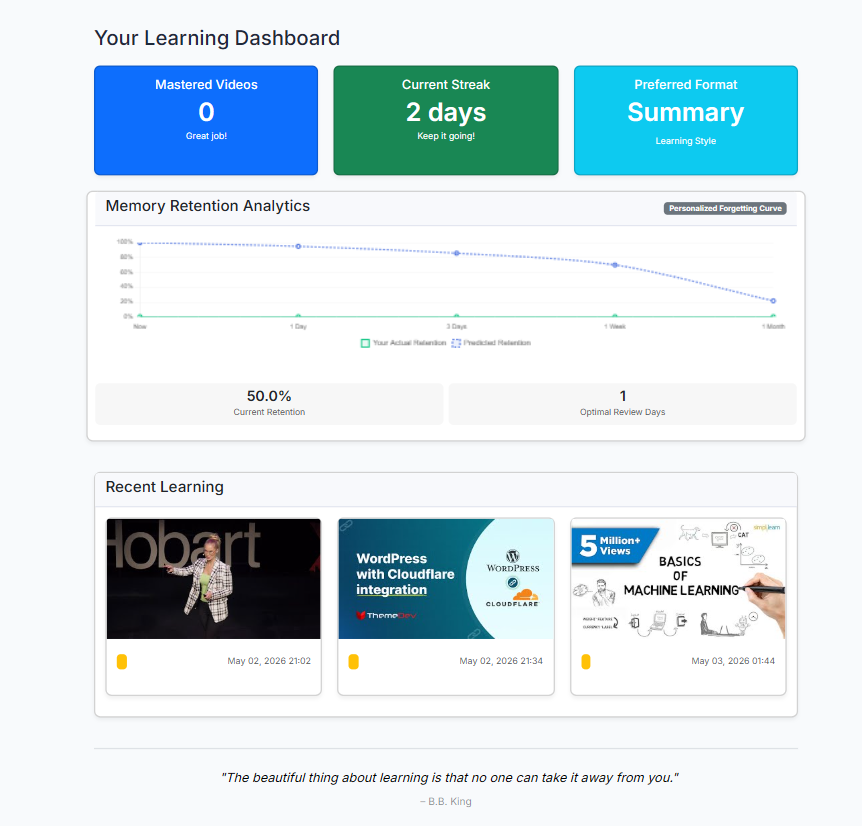
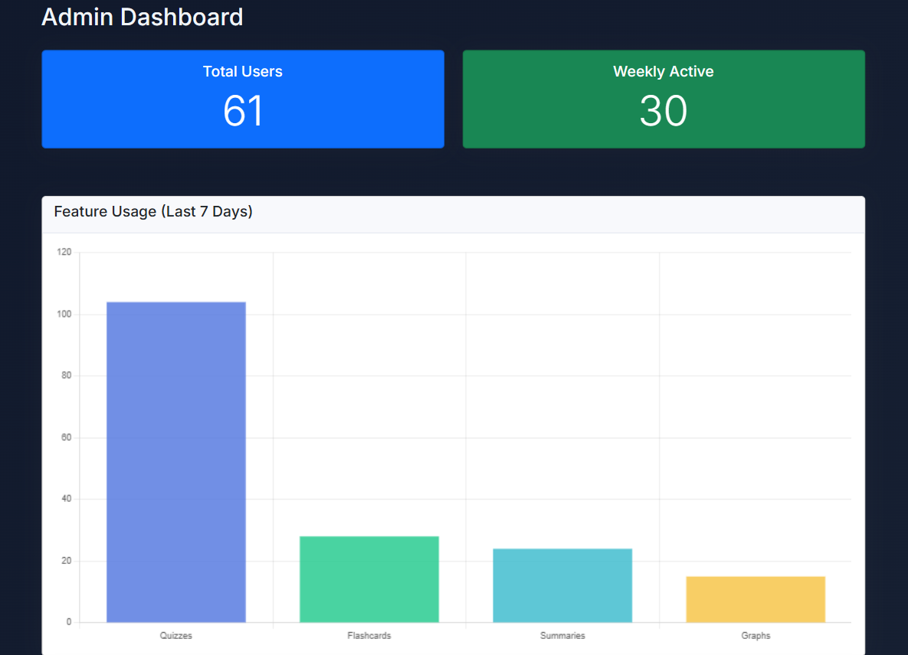

# AI-Enhanced Learning Platform — LearnTube

[](https://opensource.org/licenses/MIT)
[](https://www.python.org/downloads/)
[](test_algorithms.py)

Converts any YouTube video into a personalised study session — quizzes, summaries, flashcards, and concept maps — with three ML models tracking what you know, predicting when you'll forget it, and adapting every question to your current ability.


---

## How It Works

Paste a YouTube URL → the platform fetches the transcript, extracts key concepts (TF-IDF + spaCy NER + Gemini), and generates learning content. Every quiz response feeds back into three adaptive models running in parallel:

**Bayesian Knowledge Tracing (BKT)** — Treats mastery as a hidden variable and updates it after every answer using Bayes' rule, separating genuine knowledge from lucky guesses.

**3-Parameter Logistic IRT (Computerised Adaptive Testing)** — Selects the next question by maximising Fisher information at the learner's current estimated ability (θ), so questions are never trivially easy or impossibly hard.

**Spaced Repetition with model comparison** — Three forgetting-curve models (Ebbinghaus, ACT-R, and a personalised BayesianRidge trained on user history) compete to predict the optimal review date. The admin dashboard shows each model's MAE and RMSE on held-out quiz data.



**A/B Testing** — Experiments comparing teaching strategies use power analysis before launch, Holm–Bonferroni correction for multiple comparisons, O'Brien–Fleming alpha spending for interim looks, and Cohen's d for effect size reporting.



---

## Features

- Adaptive quiz engine — difficulty adjusted per-user using z-score performance history



- Flashcards, structured summaries, and D3.js knowledge graph

| Flashcards | Structured Summaries |
| :--- | :--- |
|  |  |



- Spaced repetition review scheduler with three competing memory models



- Weak concept identification and personalised review prioritisation
- Admin research dashboard: A/B results, IRT ability distribution, model comparison
- Chrome Extension for in-browser quizzing while watching YouTube
- Anonymous → authenticated session migration (progress preserved on signup)
- Multilingual content translation

| User Learning Dashboard | Admin Usage Analytics |
| :--- | :--- |
|  |  |
---

## Tech Stack

| Layer | Tools |
|-------|-------|
| Backend | Python 3.10, Flask, Flask-Login |
| Database | MongoDB Atlas, PyMongo |
| AI / ML | Gemini 2.5 Flash, scikit-learn, NumPy, SciPy, spaCy |
| Frontend | Bootstrap 5, Chart.js, D3.js |
| Testing | pytest, unittest.mock — 29 unit tests, no DB required |

---

## Setup

```bash
git clone https://github.com/nicolemas27/AI-Enhanced-Learning-Platform.git
cd AI-Enhanced-Learning-Platform
python -m venv venv && .\venv\Scripts\activate   # Windows
pip install -r requirements.txt
python -m spacy download en_core_web_sm
```

Create a `.env` file:
```
MONGO_URI=your_mongodb_connection_string
GEMINI_API_KEY=your_gemini_api_key
SECRET_KEY=a_long_random_string
```

```bash
python app.py
# → http://localhost:5000
```

---

## Running Tests

The algorithm tests require no database — all DB calls are mocked so they run anywhere.

```bash
python -m pytest test_algorithms.py -v   # 29 unit tests: BKT, IRT, A/B
python -m pytest retention_tests.py -v  # integration tests (needs MongoDB)
```

Tests verify hand-calculated values: BKT updates from 0.1 → exactly 0.400 after one correct answer; IRT at θ=b=0 gives exactly P=0.6. Both are mathematically correct, not just directionally plausible.

---

## Chrome Extension

1. Open `chrome://extensions/` and enable Developer mode
2. Click **Load unpacked** → select the `Extension-Quiz` folder
3. Use while watching YouTube to instantly quiz yourself on any video
